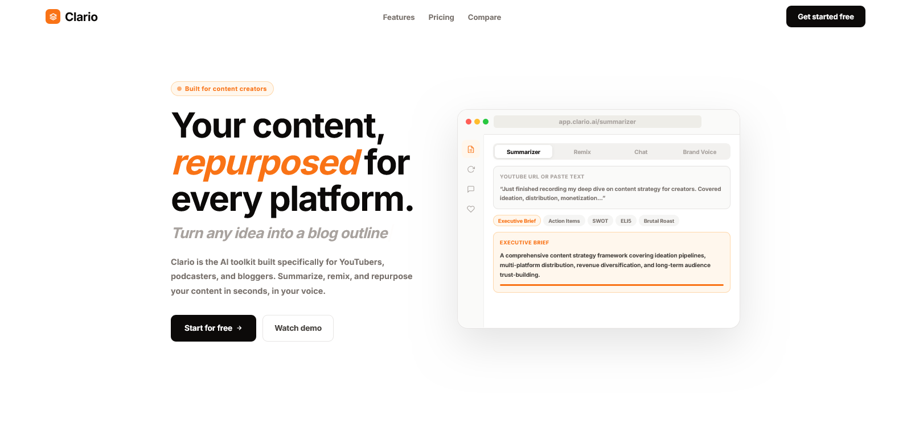

<div align="center">

  

# Clario

**AI-powered content platform for creators summarize, remix, and chat your way to better content**

[](https://clario.vercel.app)
[](LICENSE)
[](https://typescriptlang.org)
[](https://nextjs.org)
[](https://supabase.com)
[](https://groq.com)
[](https://stripe.com)
[](https://tailwindcss.com)

</div>

---

<div align="center">
  
</div>

---

Clario is a production-ready SaaS platform built for YouTubers, podcasters, bloggers, and newsletter writers who want to move faster. It turns long-form content into summaries, repurposes it across 10 platforms in one click, and gives creators an AI chat assistant that actually understands their niche. Unlike generic AI tools, Clario is purpose-built for content workflows with brand voice support, a content calendar, and usage-tiered subscriptions.

---

## ✨ Features

- 🧠 **AI Summarizer** 11 summary modes: Executive Brief, Action Items, Bullet Summary, Full Breakdown, SWOT, Meeting Minutes, Key Quotes, Sentiment, ELI5, Brutal Roast, and Decisions. Export to `.md` or `.txt`.
- 📺 **YouTube Summarizer** Paste any YouTube URL and get an instant AI summary. Supports `watch`, `shorts`, `live`, and `youtu.be` formats with multi-language transcript fallback.
- 💬 **AI Chat** Creator-focused conversational AI with persistent session history and brand voice injection.
- 🎛️ **Content Remix Studio** Turn one piece of content into 10 platform-native formats in parallel: Twitter/X thread, LinkedIn post, email newsletter, Instagram captions, YouTube description, blog outline, podcast notes, pull quotes, short-form scripts, and LinkedIn carousel.
- 🎨 **Brand Voice Library** Create and manage custom brand voices. Activate one at a time and it applies across Chat and Remix automatically.
- 📅 **Content Calendar** Schedule and track content across platforms with a full month view.
- 📊 **Dashboard** Real-time usage stats, activity charts, and an onboarding checklist.
- 💳 **Subscription Tiers** Free (100 req/month) and Pro ($19/month, 1000 req/month) via Stripe Checkout and Billing Portal.
- 🔒 **Security-first** RLS on all tables, PKCE auth, input sanitization, IP-based rate limiting, and strict CSP headers.

---

## 🛠 Tech Stack

| Category         | Technology                                                |
| ---------------- | --------------------------------------------------------- |
| Framework        | Next.js 16 (App Router)                                   |
| Language         | TypeScript 5                                              |
| UI               | React 18 + Tailwind CSS v3 + shadcn/ui + Radix UI           |
| Animations       | Framer Motion                                             |
| Charts           | Recharts                                                 |
| Database         | Supabase (PostgreSQL + RLS)                               |
| Auth             | Supabase Auth (PKCE flow)                                 |
| AI               | Groq SDK `openai/gpt-oss-120b`, `llama-3.3-70b-versatile` |
| Payments         | Stripe (Checkout + Billing Portal + Webhooks)                |
| Forms            | React Hook Form + Zod                                      |
| Package Manager  | pnpm                                                     |

---

## 🚀 Quick Start

### Prerequisites

- Node.js 18+
- pnpm (`npm install -g pnpm`)
- Supabase project
- Groq API key
- Stripe account

### Installation

```bash
# 1. Clone the repo
git clone https://github.com/MuhammadTanveerAbbas/Clario-ai.git
cd Clario-ai

# 2. Install dependencies
pnpm install

# 3. Set up environment variables
cp .env.example .env.local
# Fill in your values (see Environment Variables section below)

# 4. Run the development server
pnpm dev

# 5. Open in browser
# http://localhost:3000
```

---

## 🔐 Environment Variables

Create a `.env.local` file in the root directory (or copy from `.env.example`):

```env
# App
NEXT_PUBLIC_APP_URL=http://localhost:3000

# Supabase  https://supabase.com/dashboard/project/_/settings/api
NEXT_PUBLIC_SUPABASE_URL=https://your-project.supabase.co
NEXT_PUBLIC_SUPABASE_ANON_KEY=your_supabase_anon_key
SUPABASE_SERVICE_ROLE_KEY=your_supabase_service_role_key

# Groq AI  https://console.groq.com/keys
GROQ_API_KEY=your_groq_api_key

# Stripe  https://dashboard.stripe.com/test/apikeys
NEXT_PUBLIC_STRIPE_PUBLISHABLE_KEY=pk_test_your_key
STRIPE_SECRET_KEY=sk_test_your_key
STRIPE_WEBHOOK_SECRET=whsec_your_secret
NEXT_PUBLIC_STRIPE_PRICE_ID=price_your_pro_monthly_id
STRIPE_PRICE_PRO_MONTHLY=price_your_pro_monthly_id
STRIPE_PRICE_PRO_ANNUAL=price_your_pro_annual_id

# Admin
ADMIN_EMAIL=your-admin-email@example.com

# Rate Limiting (optional  defaults shown)
RATE_LIMIT_AUTH_MAX=5
RATE_LIMIT_AUTH_WINDOW=900
RATE_LIMIT_API_MAX=100
RATE_LIMIT_API_WINDOW=60
```

---

## 📁 Project Structure

```
clario/
├── public/                  # Static assets, favicons, manifest
├── src/
│   ├── app/
│   │   ├── (app)/           # Authenticated routes
│   │   │   ├── dashboard/
│   │   │   ├── chat/
│   │   │   ├── summarizer/
│   │   │   ├── remix/
│   │   │   ├── brand-voice/
│   │   │   ├── calendar/
│   │   │   └── settings/
│   │   ├── (auth)/          # Auth routes (sign-in, sign-up, forgot-password)
│   │   ├── (marketing)/     # Public routes (landing, pricing, privacy, terms)
│   │   └── api/             # API routes (chat, summarize, remix, stripe, etc.)
│   ├── components/
│   │   ├── ui/              # shadcn/ui primitives
│   │   ├── layout/          # Navbar, sidebar
│   │   ├── marketing/       # Marketing nav and footer
│   │   └── providers/      # Client providers
│   ├── contexts/           # AuthContext, SidebarContext
│   ├── hooks/              # Custom React hooks
│   ├── lib/
│   │   ├── supabase/        # Supabase client + server helpers
│   │   ├── ai-fallback.ts  # Groq wrapper with error normalization
│   │   ├── usage-limits.ts # Tier-based request limits
│   │   ├── security-config.ts
│   │   ├── input-validation.ts
│   │   └── stripe.ts
│   └── middleware/
│       └── rate-limit.ts
├── .env.example
├── middleware.ts
├── next.config.ts
└── package.json
```

---

## 📦 Available Scripts

| Command          | Description               |
| ---------------- | ------------------------- |
| `pnpm dev`       | Start development server  |
| `pnpm build`     | Build for production      |
| `pnpm start`     | Start production server |
| `pnpm lint`      | Run ESLint              |
| `pnpm typecheck` | Run TypeScript type check |

---

## 🗄️ Database Setup

Run these in your Supabase SQL editor.

<details>
<summary>Core Tables</summary>

```sql
create table profiles (
  id uuid references auth.users on delete cascade primary key,
  email text,
  full_name text,
  avatar_url text,
  subscription_tier text default 'free' check (subscription_tier in ('free', 'pro')),
  subscription_status text default 'inactive',
  stripe_customer_id text,
  stripe_subscription_id text,
  requests_used_this_month integer default 0,
  current_period_start timestamptz default now(),
  current_period_end timestamptz default (now() + interval '1 month'),
  created_at timestamptz default now()
);

create table ai_summaries (
  id uuid default gen_random_uuid() primary key,
  user_id uuid references profiles(id) on delete cascade,
  summary_text text,
  original_text text,
  mode text,
  youtube_url text,
  created_at timestamptz default now()
);

create table chat_sessions (
  id uuid default gen_random_uuid() primary key,
  user_id uuid references profiles(id) on delete cascade,
  title text,
  created_at timestamptz default now(),
  updated_at timestamptz default now()
);

create table chat_messages (
  id uuid default gen_random_uuid() primary key,
  session_id uuid references chat_sessions(id) on delete cascade,
  user_id uuid references profiles(id) on delete cascade,
  role text check (role in ('user', 'assistant')),
  content text,
  created_at timestamptz default now()
);

create table brand_voices (
  id uuid default gen_random_uuid() primary key,
  user_id uuid references profiles(id) on delete cascade,
  name text not null,
  examples text,
  is_active boolean default false,
  created_at timestamptz default now()
);

create table usage_tracking (
  id uuid default gen_random_uuid() primary key,
  user_id uuid references profiles(id) on delete cascade,
  type text check (type in ('summary', 'chat', 'remix', 'creator_mode')),
  created_at timestamptz default now()
);

create table usage_stats (
  id uuid default gen_random_uuid() primary key,
  user_id uuid references profiles(id) on delete cascade,
  date date not null,
  total_requests integer default 0,
  summaries_count integer default 0,
  chats_count integer default 0,
  writing_count integer default 0,
  meeting_notes_count integer default 0,
  unique(user_id, date)
);

create table processed_webhook_events (
  id text primary key,
  processed_at timestamptz default now()
);

create table feedback (
  id uuid default gen_random_uuid() primary key,
  user_id uuid references profiles(id) on delete set null,
  email text,
  feedback text,
  created_at timestamptz default now()
);

create table calendar_events (
  id uuid default gen_random_uuid() primary key,
  user_id uuid references profiles(id) on delete cascade,
  title text not null,
  scheduled_at timestamptz not null,
  platform text,
  content_text text,
  color text,
  status text default 'draft',
  created_at timestamptz default now()
);
```

</details>

<details>
<summary>RLS Policies</summary>

```sql
alter table profiles enable row level security;
alter table ai_summaries enable row level security;
alter table chat_sessions enable row level security;
alter table chat_messages enable row level security;
alter table brand_voices enable row level security;
alter table usage_tracking enable row level security;
alter table usage_stats enable row level security;
alter table feedback enable row level security;
alter table calendar_events enable row level security;

create policy "Users can view own profile" on profiles for select using (auth.uid() = id);
create policy "Users can update own profile" on profiles for update using (auth.uid() = id);
create policy "Users own their summaries" on ai_summaries for all using (auth.uid() = user_id);
create policy "Users own their sessions" on chat_sessions for all using (auth.uid() = user_id);
create policy "Users own their messages" on chat_messages for all using (auth.uid() = user_id);
create policy "Users own their brand voices" on brand_voices for all using (auth.uid() = user_id);
create policy "Users own their usage" on usage_tracking for all using (auth.uid() = user_id);
create policy "Users own their stats" on usage_stats for all using (auth.uid() = user_id);
create policy "Users own their feedback" on feedback for all using (auth.uid() = user_id);
create policy "Users own their calendar events" on calendar_events for all using (auth.uid() = user_id);
```

</details>

<details>
<summary>RPC Functions</summary>

```sql
create or replace function track_usage(p_user_id uuid, p_type text, p_count integer default 1)
returns void language plpgsql security definer as $$
begin
  insert into usage_tracking (user_id, type) values (p_user_id, p_type);
  update profiles
  set requests_used_this_month = requests_used_this_month + p_count
  where id = p_user_id;
end;
$$;

create or replace function handle_new_user()
returns trigger language plpgsql security definer as $$
begin
  insert into profiles (id, email, full_name, avatar_url)
  values (
    new.id,
    new.email,
    new.raw_user_meta_data->>'full_name',
    new.raw_user_meta_data->>'avatar_url'
  )
  on conflict (id) do nothing;
  return new;
end;
$$;

create trigger on_auth_user_created
  after insert on auth.users
  for each row execute procedure handle_new_user();
```

</details>

---

## 🌐 Deployment

### Vercel (Recommended)

[](https://vercel.com/new/clone?repository-url=https://github.com/MuhammadTanveerAbbas/Clario-ai)

1. Click the button above or import the repo in Vercel
2. Add all environment variables in the Vercel dashboard
3. Set `NEXT_PUBLIC_APP_URL` to your production domain
4. Deploy

> AI routes use `maxDuration` of 60–90 seconds. Vercel Pro plan required for functions exceeding 10s.

### Stripe Webhook Setup

1. Create a webhook endpoint in Stripe pointing to `https://yourdomain.com/api/stripe/webhook`
2. Subscribe to: `checkout.session.completed`, `customer.subscription.updated`, `customer.subscription.deleted`
3. Copy the signing secret to `STRIPE_WEBHOOK_SECRET`

### Supabase Auth Setup

1. In Supabase → Authentication → URL Configuration:
   - Set **Site URL** to your production domain
   - Add `https://yourdomain.com/auth/callback` to **Redirect URLs**
2. For Google OAuth: Authentication → Providers → Google → add your OAuth credentials

---

## 🗺 Roadmap

- [x] AI Summarizer with 11 modes
- [x] YouTube transcript summarization
- [x] Content Remix Studio (10 formats)
- [x] Brand Voice Library
- [x] AI Chat with session history
- [x] Content Calendar
- [x] Stripe subscription billing
- [ ] Team/workspace collaboration
- [ ] Chrome extension for one-click summarization
- [ ] Mobile app

---

## 🤝 Contributing

Contributions are welcome. Feel free to:

1. Fork the repository
2. Create a feature branch (`git checkout -b feature/amazing-feature`)
3. Commit your changes (`git commit -m 'Add amazing feature'`)
4. Push to the branch (`git push origin feature/amazing-feature`)
5. Open a Pull Request

---

## 📄 License

Distributed under the MIT License. See `LICENSE` for more information.

---

## 👨‍💻 Built by The MVP Guy

<div align="center">

**Muhammad Tanveer Abbas**
SaaS Developer | Building production-ready MVPs in 14–21 days

[](https://themvpguy.vercel.app)
[](https://x.com/themvpguy)
[](https://linkedin.com/in/muhammadtanveerabbas)
[](https://github.com/MuhammadTanveerAbbas)

_If this project helped you, please consider giving it a ⭐_

</div>